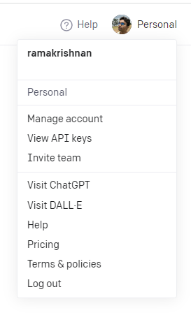

## Create Custom Connector

## Get OpenAI API key

1. Go to OpenAI's Platform website at https://platform.openai.com/ and sign in with an OpenAI account.

2. Click your profile icon at the top-right corner of the page and select "View API Keys."

  

3. Click "Create New Secret Key" to generate a new API key.

  

## Create custom connector to interact with Open AI API

Follow below steps to setup ChatGPT(gpt-3.5-turbo based) custom connector

1. Go to **Custom connectors** section under Makers Portal - https://make.powerapps.com/.


2. Click on **+ New custom connector**, select **Create from blank** and provide a name, e.g. "ChatGPT Connector" and click continue.


3. Under **General**  section, specify the **Host** as **api.openai.com**, optional, provide an icon for the custom connector.


4. Under **Security** section, specify the **API key** as **Authentication type**. Under API key sub-section, Add **API Key** as **Parameter label** and **Authorization** as **Parameter name**.


5. Under **Definition**, click on **New Action**
    1. Under General section, provide **Summary** as **ChatGPT API** and **Operation ID** as **ChatAPI**.

    

    2. Click on **+ Import from sample** under **Request** section

    Add the following in the below order and click on Import once done.

    **Verb** - **POST**

    **URL** - **https://api.openai.com/v1/chat/completions**

    **Headers** - **Content-Type application/json**

    **Body** -

    ```JSON
    {
    "model":"gpt-3.5-turbo",
    "messages":[{"role":"","content":""}]
    }
    ```

    

    3. After import, click on **Content-Type** dropdown under **Request** section and select **Edit**.

    4. Set the **Default value** as **application/json**, **Is required** as **Yes** and **Visibility** as **internal**. Go back.

    

    5. Similarly, select **body** dropdown under **Request** section and select **Edit**.

    6. Set **Is required** as **Yes** and **Visibility** as **important**.

    

    7. Repeat the step for **content**, **role** and **model** dropdowns located under **body** parameter, by setting **Is required** as **Yes** and **Visibility** as **important**.

    

    8. Click on **Create Connector**.

    9. Under **Test** section click on **+ New connection** and enter key with a prefix **Bearer ** (_Bearer with a space_)

    

    10. Once setup successfully, the connector will show up under connections section

     

    11. Complete the **Test Connector** steps. See - next section.

## Test Connector

To test the connector follow the below step

1. Go to **Custom connectors** section under Makers Portal (https://make.powerapps.com/) and select the connector(ChatGPT Connect) created in previous section.
2. Go to **Test** section. By default, **Connection** should populate under selected connection.
    
3. Under **Operations** section, enter **gpt-3.5-turbo** as model, role as **user** and content as **What does CDS mean in Power Platform?** to **Test operation**. Click **Test operation** and copy the response value under **Body** section once complete.

    

    

4. Go to **Definition** and select **default** under **Response** section.

    

5. Click **Import from sample** and paste the response value copied in step 3. Click Import.
6. Update the connector again.