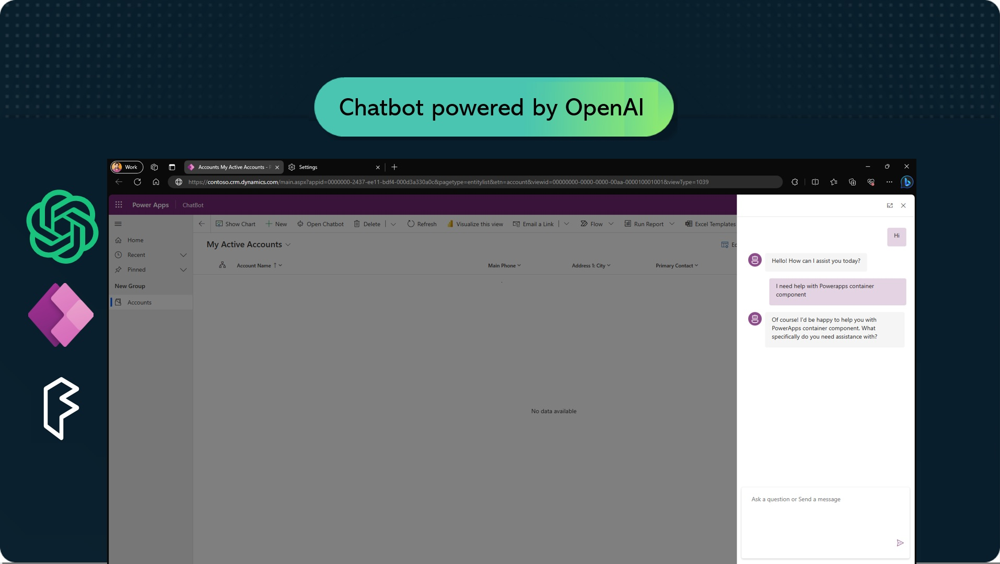
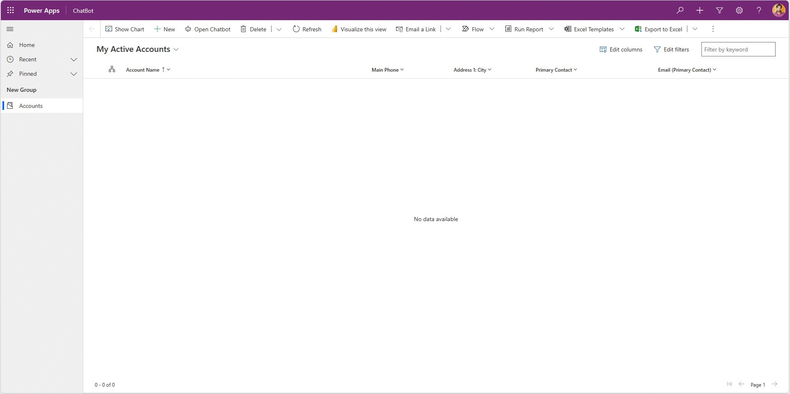
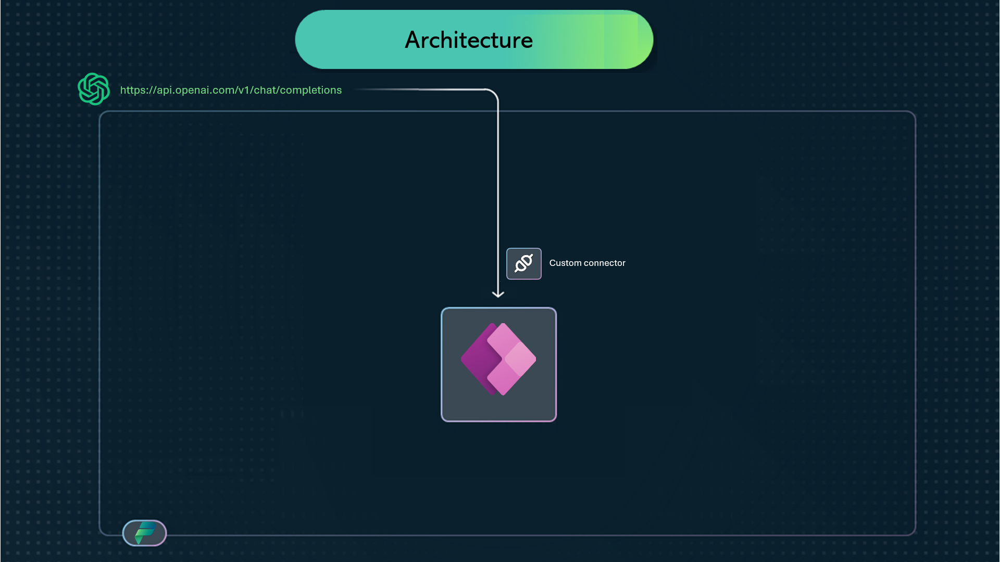
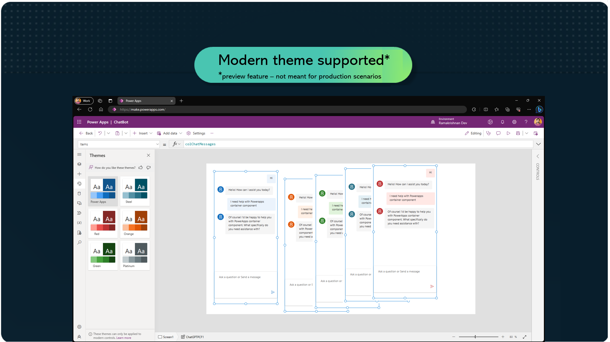
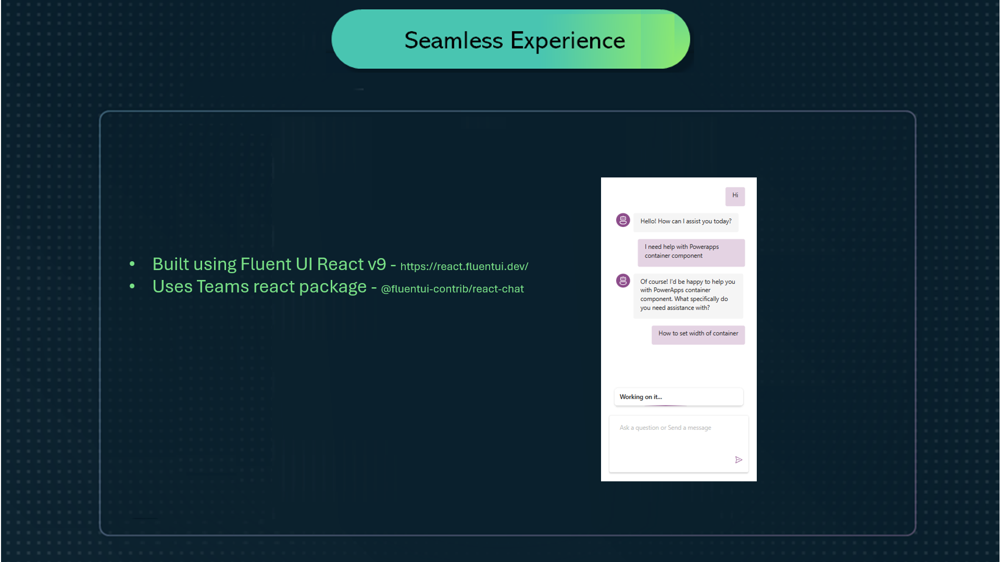
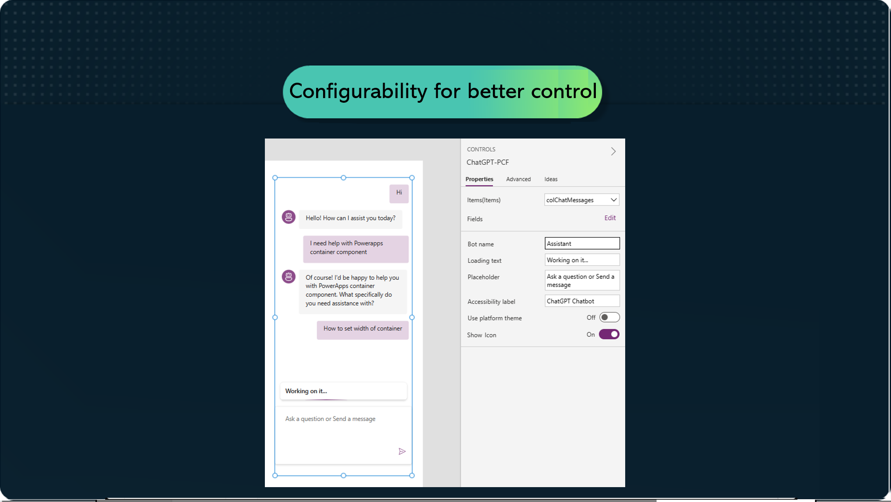

# Power Chatbot Code Component - powered by Open AI

The Power Chatbot component allows you to provide a truly conversational user experience/interface inside canvas apps and custom pages.



## 🤖 Glimpse of PowerChatbot

Glimpse of PowerChatbot configured inside Model driven app using custom page.



## 📘 How it works

Power Chatbot component solely rely on Custom connector, as it does most of heavy lifting, i.e. to interact with OpenAI API and bring back results.



## 👨🏻‍💻 Setup & 🪛 Configuration

Setup and configuration requires below mentioned steps.

#### Step 1 - Setup custom connector

[ Setup custom connector](/Setup-customconnector.md)

#### Step 2 - Import code component

1. Enable **Code components for canvas apps** in your environment. See [Code components for canvas apps - Power Apps | Microsoft Learn](https://learn.microsoft.com/en-us/power-apps/developer/component-framework/component-framework-for-canvas-apps#enable-the-power-apps-component-framework-feature)
2. Import the **PowerChatbot** solution into your environment.
3. Inside a solution, create a new custom page or canvas app.
4. From the side panel **Insert** menu, select **Get more components** from the footer section.
5. From the Code tab that appears inside the Import Components panel that appears, select the **Power Chatbot** component, and select **Import**.
6. From the side bar Insert menu, expand **Code components**, and select the **Power Chatbot** to place it on your canvas or custom page.
7. From the side panel **Data** menu, select **+ Add data** and choose ChatGPTConnector **custom connector** created in previous step - **Step 1**.


The Power Chatbot renders the Item collection provided via **Items** property and expects it to be in a specific defined format.

#### Step 3 - Configure control

Power Chatbot triggers an OnSubmit event each time a text is submited either via click or Send Button.

1. Inside **OnSubmit** add the following

```
Set(
    varResponses,
    ChatGPTConnector.ChatAPI(
        "gpt-3.5-turbo",
        Collect(
            colChatMessages,
            {
                role: "user",
                content: Self.SubmittedText
            }
        )
    )
);
Collect(
    colChatMessages,
    First(varResponses.choices).message
);

```

2. Add **colChatMessages**  to **Items** property.

Below is an example of a resulting format.

  ```
   Collect(
    colChatMessages,
    Table(
        {
            role: "user",
            content: "Hi"
        },
        {
            role: "assistant",
            content: "Hello! How can I assist you today?"
        },
        {
            role: "user",
            content: "I need help with Powerapps container component"
        },
        {
            role: "assistant",
            content: "Of course! I'd be happy to help you with PowerApps container component. What specifically do you need assistance with?"
        }
    )
);
```

## 🪂 Theming

Power Chatbot by default comes with a default theming. However if **Use platform theme** is turned on, it will inherit and rely on Modern controls and theme.

To enable this feature, see [Enable modern controls and themes for your app](https://learn.microsoft.com/en-us/power-apps/maker/canvas-apps/controls/modern-controls/overview-modern-controls#enable-modern-controls-and-themes-for-your-app)


> **_Important :_**  Modern controls and themes are preview features and not meant for production use.



## 🪩 Seamless Experience

Power Chatbot uses [Fluent UI React v9](https://react.fluentui.dev/) framework along with [Team's React Chat Package](https://github.com/microsoft/fluentui-contrib/tree/main/packages/react-chat) to bring the chat experience close to Microsoft Teams.



## 🔩 Configurability for better control

Power Chatbot comes with different configurable options to choose from inorder to change the user experience.



## 🛣️ Future roadmap

- UI improvements close to perfection. Especially from accessibility stand point.
- Explore the possibilities with Azure Open AI API and guidance.
